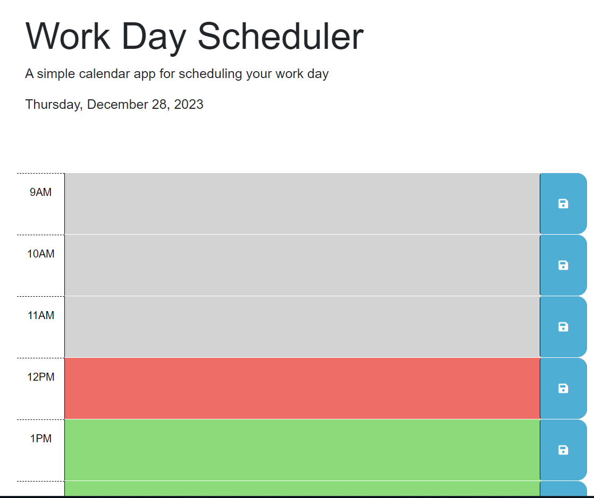

# work-day-scheduler

<h1>Description</h1>
Welcome to the work day scheduler!
The work day scheduler was a starter code, it was a simple project where 
I had to add some funtions to resemble the mock up challenge. adding time block functions and text areas to fill a work day schedule. Enjoy the Work day scheduler!

<h2>User Story</h2>
AS AN employee with a busy schedule
I WANT to add important events to a daily planner
SO THAT I can manage my time effectively

<h3>Acceptance Criteria</h3>
GIVEN I am using a daily planner to create a schedule
WHEN I open the planner
THEN the current day is displayed at the top of the calendar
WHEN I scroll down
THEN I am presented with time blocks for standard business hours of 9am to 5pm
WHEN I view the time blocks for that day
THEN each time block is color-coded to indicate whether it is in the past, present, or future
WHEN I click into a time block
THEN I can enter an event
WHEN I click the save button for that time block
THEN the text for that event is saved in local storage
WHEN I refresh the page
THEN the saved events persist

<h4>Usage</h4>
https://github.com/FisherK19/work-day-scheduler
https://fisherk19.github.io/work-day-scheduler/